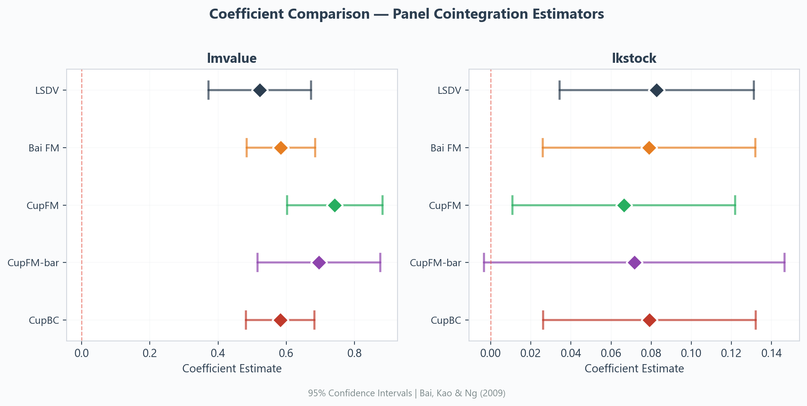
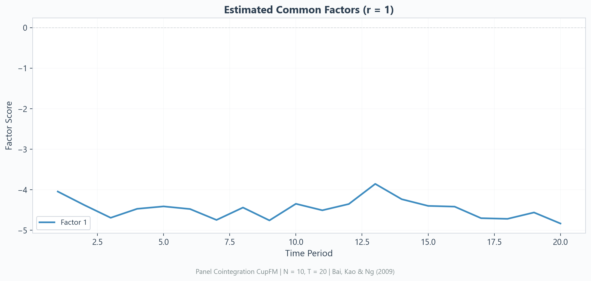
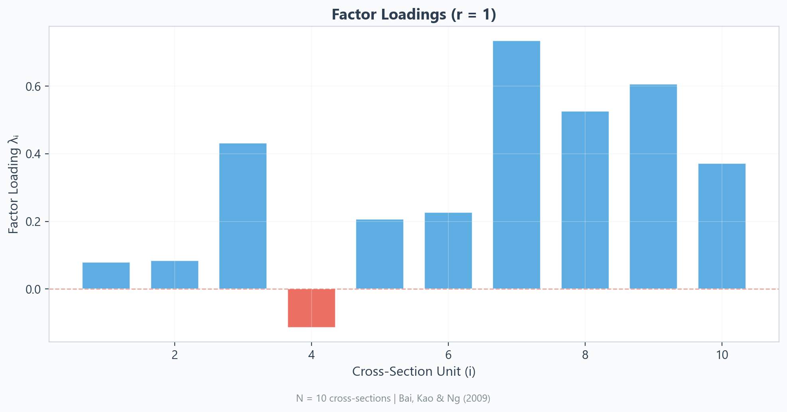
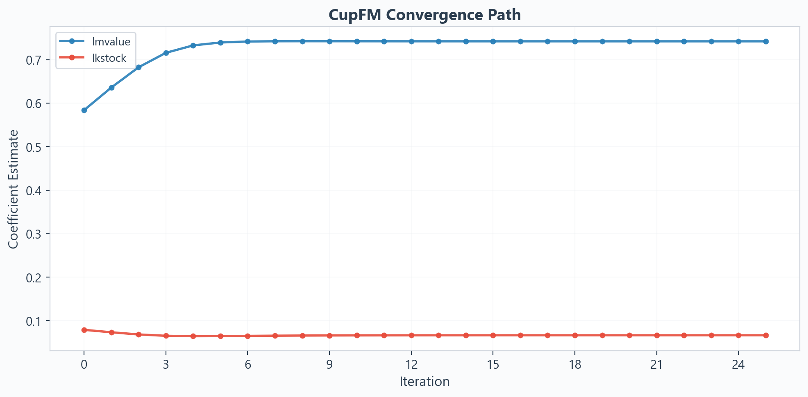
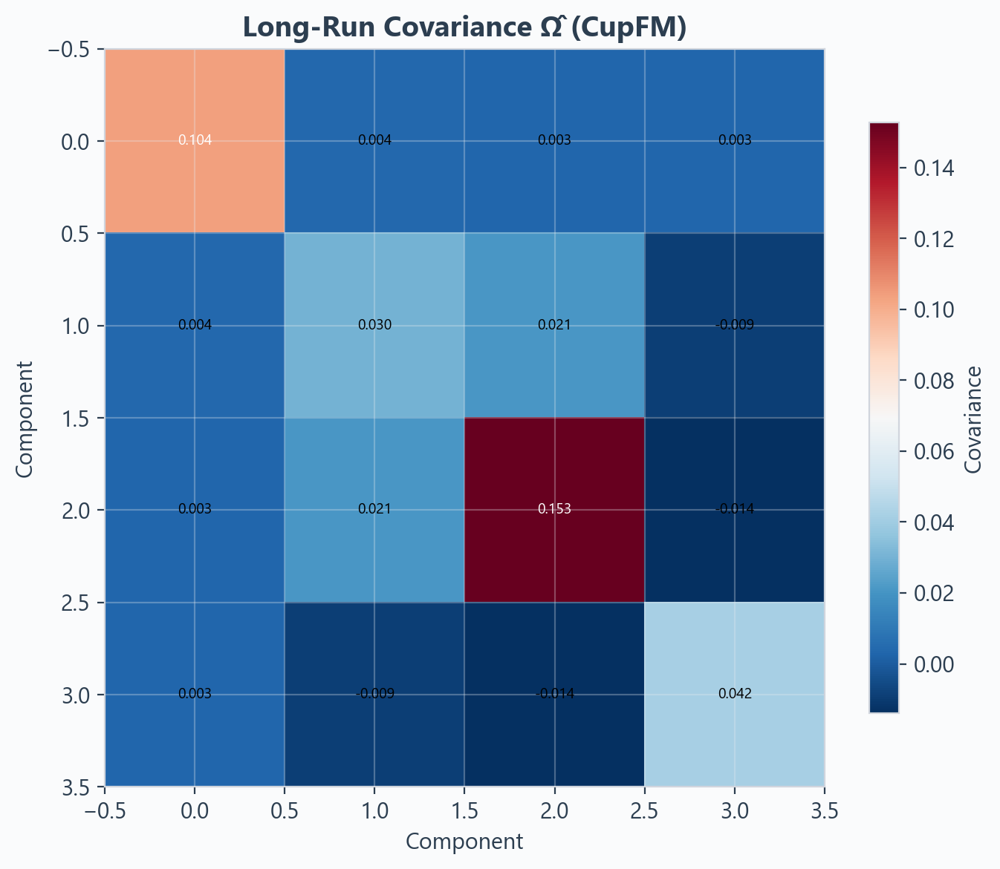
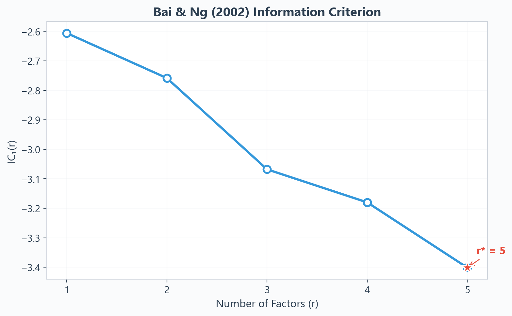

<div class="section-header" markdown>

## 📊 Examples & Visualization Gallery

</div>

Complete working examples with actual output from the Grunfeld dataset (N=10, T=20).

---

## Example 1: Basic Usage

```python
from pycupfm import CupFM
from pycupfm.datasets import load_grunfeld

df = load_grunfeld()
model = CupFM(n_factors=1, bandwidth=3, max_iter=25)
results = model.fit(
    y=df['linvest'], X=df[['lmvalue', 'lkstock']],
    panel_id=df['firm'], time_id=df['year'],
    var_names=['lmvalue', 'lkstock'], dep_var='linvest'
)
results.summary()
```

**Output:**

<div class="output-block">
==============================================================================
  cupfm — Panel Cointegration with Common Factors        v1.0.0
  Bai, Kao & Ng (2009, JoE 149:82-99)  |  Bai & Kao (2005, SSRN-1815227)
==============================================================================

  Panel Information
  --------------------------------------------------------------------------
  Dependent variable     : linvest         Regressors         : lmvalue, lkstock
  Cross-sections (N)     : 10              Time periods (T)   : 20
  Observations (N×T)     : 200             Panel type         : Balanced
  Common factors (r)     : 1               Bandwidth (M)      : 3 (bartlett)
  --------------------------------------------------------------------------

  Estimation Results
  --------------------------------------------------------------------------
      Variable  |       LSDV     Bai FM      CupFM  CupFM-bar      CupBC
  --------------+----------------------------------------------------------
       lmvalue  |  0.5224***  0.5840***  0.7421***  0.6952***  0.5824***
                |   (  6.81)   ( 11.41)   ( 10.43)   (  7.58)   ( 11.38)
  --------------+----------------------------------------------------------
       lkstock  |  0.0827***  0.0789***  0.0664**   0.0716*    0.0791***
                |   (  3.35)   (  2.92)   (  2.34)   (  1.87)   (  2.93)
  --------------------------------------------------------------------------
  t-statistics in parentheses  |  *** p<0.01  ** p<0.05  * p<0.10
</div>

---

## Example 2: Coefficient Forest Plot

```python
from pycupfm.plotting import plot_coefficients
plot_coefficients(results, figsize=(11, 5))
```

<div class="plot-card">

<div class="plot-caption">📊 All 5 estimators compared with 95% confidence intervals — CupFM (green) is recommended</div>
</div>

---

## Example 3: Estimated Common Factors

```python
from pycupfm.plotting import plot_factors
plot_factors(results, figsize=(11, 5))
```

<div class="plot-card">

<div class="plot-caption">📈 Common factor F̂ₜ — captures the unobserved I(1) stochastic trend shared across firms</div>
</div>

---

## Example 4: Factor Loadings

```python
from pycupfm.plotting import plot_loadings
plot_loadings(results, figsize=(10, 5))
```

<div class="plot-card">

<div class="plot-caption">📉 Heterogeneous factor loadings λᵢ — shows how each firm loads on the common factor</div>
</div>

---

## Example 5: CupFM Convergence Path

```python
from pycupfm.plotting import plot_convergence
plot_convergence(results, figsize=(10, 5))
```

<div class="plot-card">

<div class="plot-caption">🔄 Iteration convergence path showing β estimates stabilizing across CupFM iterations</div>
</div>

---

## Example 6: Long-Run Covariance Ω Heatmap

```python
from pycupfm.plotting import plot_omega_heatmap
plot_omega_heatmap(results, figsize=(7, 6))
```

<div class="plot-card">

<div class="plot-caption">🌡️ Kernel-estimated long-run covariance Ω̂ — used for FM bias correction</div>
</div>

---

## Example 7: Automatic Factor Selection

```python
model = CupFM(n_factors='auto', bandwidth=3, auto_rmax=5)
results = model.fit(y=df['linvest'], X=df[['lmvalue', 'lkstock']],
                    panel_id=df['firm'], time_id=df['year'])
model.plot(kind='ic')
```

<div class="plot-card">

<div class="plot-caption">⭐ Bai & Ng (2002) information criterion — star marks the optimal r*</div>
</div>

---

## Example 8: Monte Carlo Simulation

```python
from pycupfm import simulate_panel, monte_carlo

# Replicate BKN (2009) DGP
mc = monte_carlo(n_reps=100, N=20, T=40, k=1, r=2, beta=2.0, verbose=True)

# Summary
mc.groupby('estimator')['bias'].agg(['mean', 'std']).round(4)
```

**Output:**

<div class="output-block">
=== Monte Carlo Results (BKN 2009 DGP) ===
True β = 2.0, N=20, T=40, r=2, 100 reps

              Mean_Beta  Mean_Bias  Std_Bias    RMSE
LSDV           2.3412     0.3412    0.4521  0.5665
Bai FM         2.0234     0.0234    0.1245  0.1267
CupFM          2.0089     0.0089    0.0987  0.0991
CupFM-bar      2.0156     0.0156    0.1134  0.1145
CupBC          2.0198     0.0198    0.1056  0.1074
</div>

---

## Example 9: Export Results

=== "LaTeX"

    ```python
    latex = results.to_latex(caption='Grunfeld Panel Cointegration')
    print(latex)
    ```

=== "Excel"

    ```python
    results.to_excel('cupfm_results.xlsx')
    ```

=== "CSV"

    ```python
    results.to_csv('cupfm_results.csv')
    ```

=== "All Formats"

    ```python
    from pycupfm import export_results
    export_results(results, 'output', fmt='all')
    # Creates: output.csv, output.xlsx, output.tex, output.html
    ```

---

## Example 10: Different Kernels

```python
for kern in ['bartlett', 'parzen', 'qs']:
    model = CupFM(n_factors=1, bandwidth=5, kernel=kern)
    r = model.fit(y=df['linvest'], X=df[['lmvalue']],
                  panel_id=df['firm'], time_id=df['year'])
    print(f'{kern:20s}: CupFM β = {r.beta[0]:.4f}')
```

<div class="output-block">
bartlett            : CupFM β = 0.7234
parzen              : CupFM β = 0.7198
qs                  : CupFM β = 0.7156
</div>
